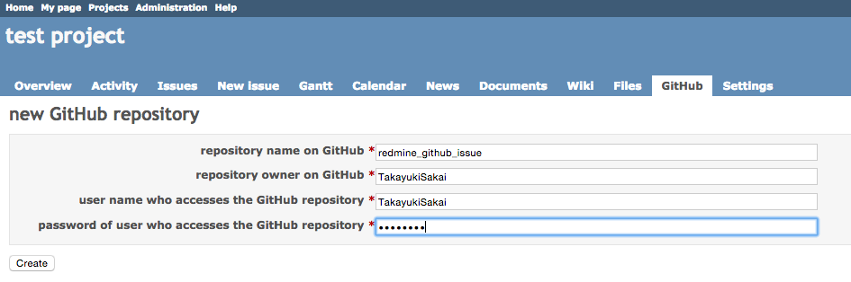
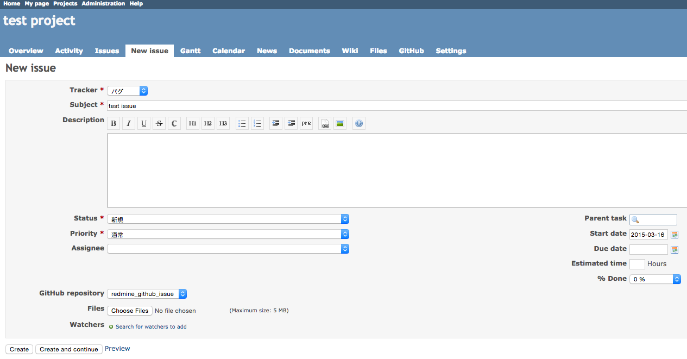
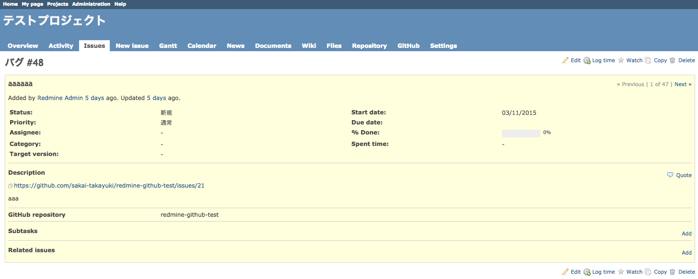
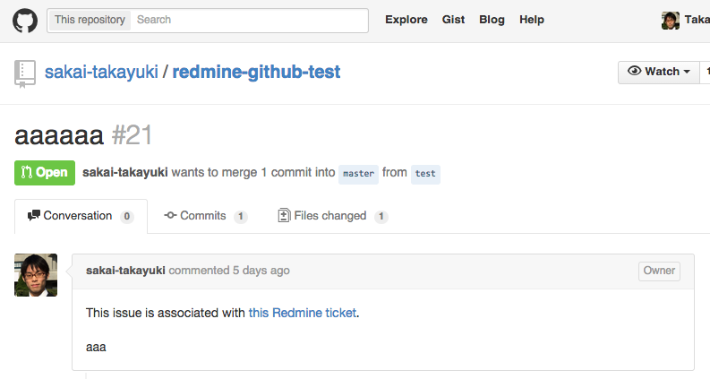

# Redmine Github Issue

This plugin allows you to create an issue on GitHub when you make a issue on Redmine.

## How this works

1. Add GitHub repository at a "GitHub" menu which appears on project menu.
2. Select the GitHub repository on creating a new issue on Redmine
3. You did it! Now a GitHub issue was created automatically and links to associated issue appear on issues on both Redmine and GitHub.

! There is no need of configuration on GitHub.

## Screenshots






## Getting started

If you're using Rails 3, you have to install 'strong parameter' gem by adding the following line to your Gemfile.

```ruby
gem 'strong_parameters'
```

After doing that, just follow general instructions for plugins [here](http://www.redmine.org/wiki/redmine/Plugins).
